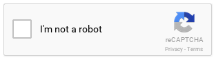

#Play reCAPTCHA Module 

This is a [Play Framework](http://www.playframework.com) module, for Scala and Play 2.x, to provide integration 
with [Google reCAPTCHA](http://www.google.com/recaptcha) in a reactive (non-blocking) manner.

Both reCAPTCHA versions 1 and 2 are supported.

##Module Dependency
The play-recaptcha module is distributed using Maven Central so it can be easily added as a library dependency in your
Play Application's SBT build scripts.

##How to use
Please see the [wiki](http://www.github.com/chrisnappin/play-recaptcha/wiki) for details of
how to use this module.

###License
The Play reCAPTCHA Module is copyright Chris Nappin, and is released under the 
[Apache 2 License](http://www.apache.org/licenses/LICENSE-2.0).

###Trademarks
Google and possibly reCAPTCHA are trademarks of Google Inc.
